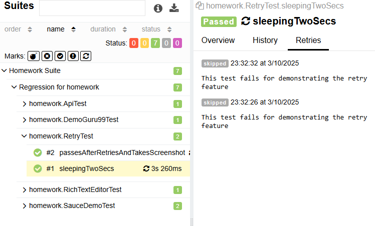
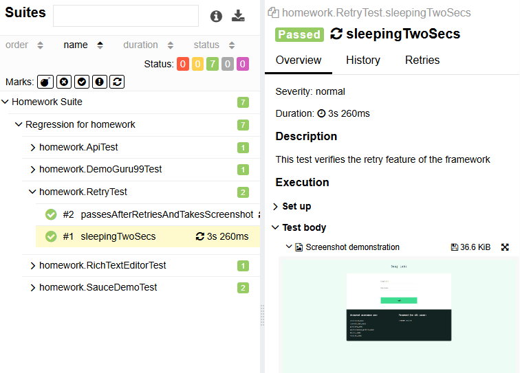

# Test framework features [](https://github.com/gyapeee/homework/actions/workflows/maven.yml)

Here are the features of Selenium, TestNG, Maven and Java based test framework

## Parallel test runs with TestNG

- CI workflow runs in parallel by default: https://github.com/gyapeee/homework/actions/workflows/maven.yml
- The tests can run sequentially in local if it is required by changing the ```src/test/resources/testng.xml```
    - Remove ``` parallel="methods" thread-count="6"``` from
      ```<suite name="Homework Suite" verbose="1" parallel="methods" thread-count="6">```

## Reporting with Allure

- A Quality gate is provided by scheduling test runs and Allure reports
  history:  https://gyapeee.github.io/homework/index.html
- See the Retry demonstration at the result of homework.RetryTest.sleepingTwoSecs
  
- See the screenshot demo at the result of homework.RetryTest.sleepingTwoSecs
  

## Logging with slf4j and log4j

- Each driver related action is wrapped with logs in DriverActionListener.java

```java

@Slf4j
public class DriverActionListener implements WebDriverListener {

    @Override
    public void beforeAnyCall(Object target, Method method, Object[] args) {
        log.info(String.format("Thread: %s | Before | Method Name: %s | Method Args: %s",
                               Thread.currentThread().getName(), method.getName(), Arrays.toString(args)));
    }

    @Override
    public void afterAnyCall(Object target, Method method, Object[] args, Object result) {
        log.info(String.format("Thread: %s | After  | Method Name: %s | Method Args: %s",
                               Thread.currentThread().getName(), method.getName(), Arrays.toString(args)));
    }
}
```

- This can be customized by overriding empty default methods(eg. ```default void beforeClick(WebElement element) {}```)
  of WebDriverListener.

## Web Driver Manager

- Used for smartly managing chrome drivers
- Also runs selenium grid programmatically
  ```java 
  
  @BeforeTest(alwaysRun = true)
  public void setUpTest() {
      // Resolve driver for Selenium Grid
      WebDriverManager.chromedriver().setup();
  
      // Start Selenium Grid in standalone mode
      Main.main(new String[]{
              "standalone",
              "--port",
              "4445"
      });
  }
  ```

## Headless mode (default)

- Tests can run in headed mode by changing the ```headless=true``` to ```headless=false``` in
  ```config.properties file```

## Implement PageObjectModel

- Test cases use Page Objects to make the framework reusable and maintainable
    - Example Page Object.
    ```java 
    public class CheckoutCompleted {
      @FindBy(css = "[data-test='checkout-complete-container']")
      private WebElement checkoutComplete;
    
      @FindBy(css = "[data-test='complete-header']")
      private WebElement header;
    
      public CheckoutCompleted() {
        PageFactory.initElements(Driver.get(), this);
        Wait.forVisible(checkoutComplete);
      }
    
      public WebElement getHeader() {
        return Wait.forVisible(header);
      }
    }
    ```

## Action utility classes

- Use actions via action util classes to make the code more readable
- Example Action

```java
public class Scroll {
    private Scroll() {
    }

    public static void to(WebElement element) {
        new Actions(Driver.get()).moveToElement(element).perform();
    }
}
```

## Rest Assured for API tests

- JSON parsing is provided by the RestAssured 3rd party lib so this can cause more maintainable code
    - BDD like(given/when/then) coding can be done by RestAssured

```java

@Feature("Homework")
@Story("ApiTest")
@Description("More compact RestAssured demo")
public void restAssuredDemo() {
    io.restassured.response.Response response = get(URL);

    Assert.assertNotNull(response, "Response is null");
    Assert.assertEquals(response.getStatusCode(), HTTP_OK,
                        "Response code is not " + HTTP_OK + " but " + response.getStatusCode());

    List<User> users = Arrays.asList(response.getBody().as(User[].class));
    Assert.assertTrue(users.get(0).getEmail().contains("@"), "@ symbol is missing from the first user's email ");
}
```

## Customizable waiting

- The waiting mechanism is built upon a default FluentWait with 5 seconds timeout and 200 milliseconds polling time.
  This can be overwritten by each test class. Here is an example of adding 30 seconds timeout with 1000 milliseconds
  polling time.

```java
public class DemoGuru99Test extends TestBase {

    ...

    @BeforeMethod
    public void setUp() {
        super.setup();
        Wait.init(_30_SECONDS, _1000_MILLIS);
    }
    ...
```

<details>
  <summary>Homework plan</summary>

- Breaking the task down into steps can be seen below

#### Prepare project

- ~~Create github repo~~
    - ~~Create maven project~~
    - ~~Add dependencies~~
        - ~~Additional dependencies like WDM(optional)~~
    - ~~Basic tests~~
        - ~~UI~~
        - ~~API~~
        - ~~Sequential run~~
    - ~~Reporting~~
        - ~~Logging~~

#### Test implementation

- ~~Test 1~~
    - ~~Test 2~~
    - ~~Test 3~~
    - ~~Test 4~~
    - ~~Test 5 - REST api~~

#### Extra improvements

- ~~Use PageObjects~~
    - ~~Retry tests~~
    - ~~Parallel run~~
        - ~~Verify both sequential and parallel run~~
    - ~~GitHub actions~~
        - ~~build~~
        - ~~CI~~
    - ~~Find advanced waiting mechanism~~
        - ~~Each test class can set up a fluent wait for Wait actions~~
    - ~~Write a basic driver handler~~
    - ~~Use Rest Assured~~
    - ~~Allure reports~~
    - Refactoring

#### Questions

- is it ok filling any data as Checkout Info(firstName, lastNem, ZipCode) during checkout process?
    - Is it ok adding standard_user to credentials.properties?
    - What is the precise meaning of the next sentence in test 4?
      "Find the Email Submission text. Fill out the field below it and click the Submit button.". Should I use relative
      locators?

#### Dev Notes

- The **_Test_X** postfix in test method's name is only for the easier identification of the test case regarding the
  documentation
  (description of homework)

</details>
